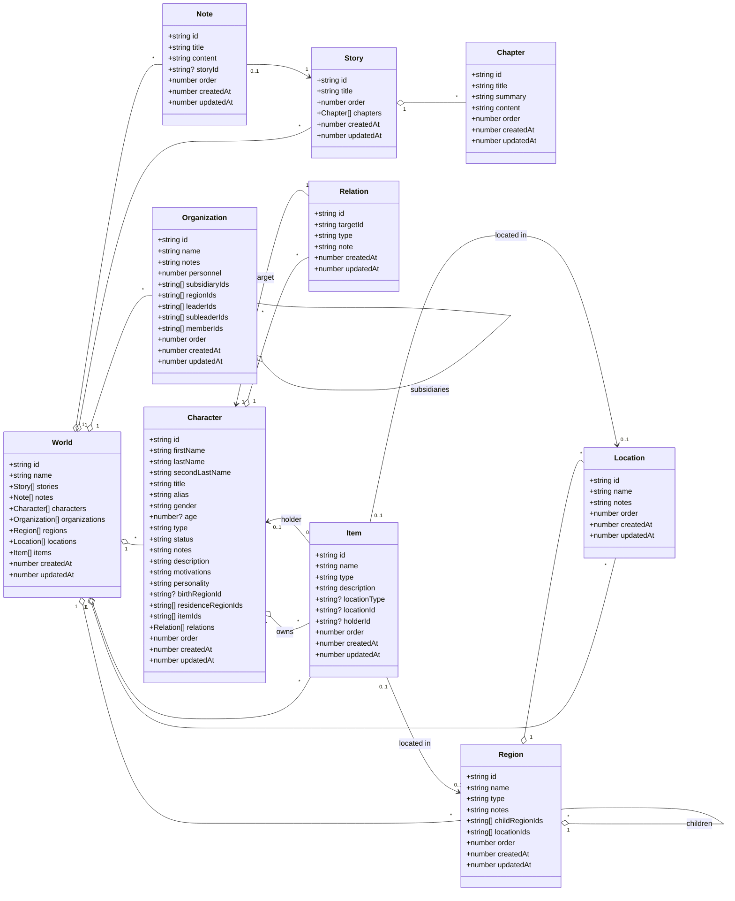

# Diagrama de Clases

> Nota: Este diagrama representa el modelo de dominio que maneja la interfaz de Quest4Quill.

## Como verlo

- En VS Code, abre este archivo y usa la vista previa de Markdown.
- En GitHub, los bloques Mermaid se renderizan de forma nativa.
- Si tu editor no muestra Mermaid, puedes pegar el contenido en un visor compatible.

## Lectura rapida

- El diagrama de clases muestra la forma de los objetos que maneja la interfaz.
- Si quieres, este mismo contenido se puede convertir despues a SVG o PNG para insertarlo en la app o en el README.
