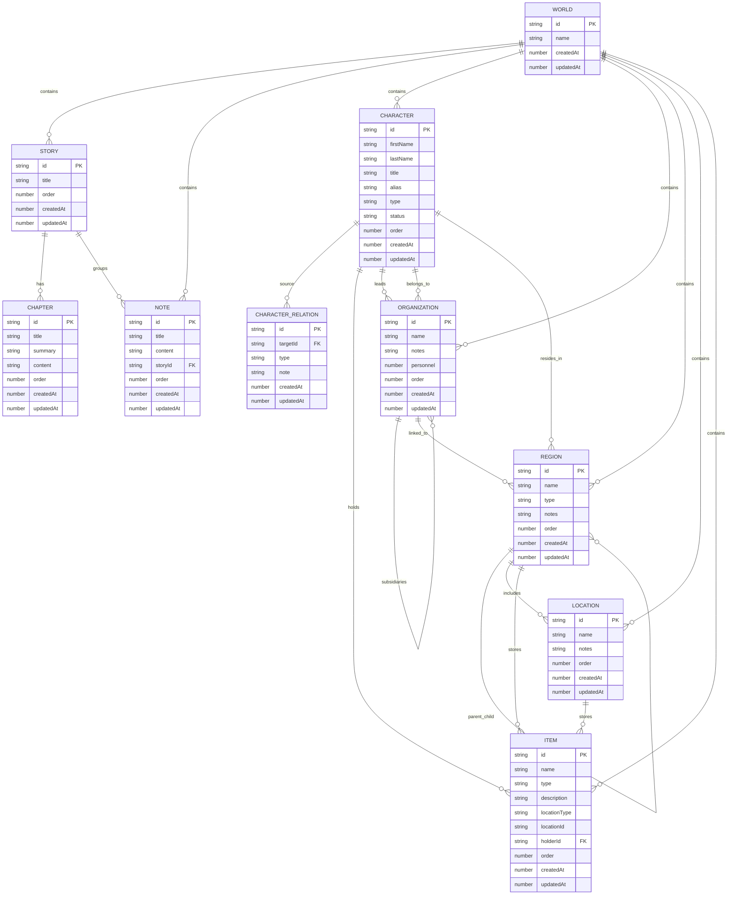

# Diagrama de Datos

> Nota: Quest4Quill no usa una base de datos relacional. La persistencia actual vive en `localStorage`, asi que este diagrama representa el modelo logico de datos.

## Como verlo

- En VS Code, abre este archivo y usa la vista previa de Markdown.
- En GitHub, los bloques Mermaid se renderizan de forma nativa.
- Si tu editor no muestra Mermaid, puedes pegar el contenido en un visor compatible.

## Lectura rapida

- Este diagrama muestra como se conectan los datos dentro del almacen local.
- Si quieres, este mismo contenido se puede convertir despues a SVG o PNG para insertarlo en la app o en el README.
